# Portfolio Website – Frontend Developer Portfolio

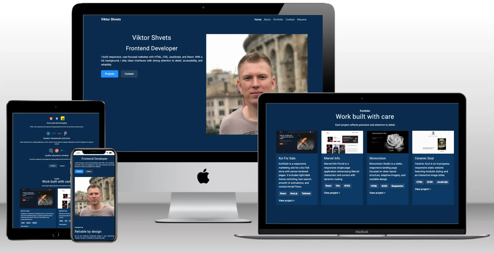

**Live Website:** https://shvetsviktor.github.io/My_Portfolio/

## Overview

A single-page portfolio website built with HTML5, CSS3, and Bootstrap 5.3.
The project focuses on clear purpose, strong information hierarchy, accessibility, responsive layout, and professional documentation.

It follows a **user-centred front-end development** approach: the focus is on clear purpose, strong information hierarchy, accessibility, responsiveness, and professional documentation.

## Table of Contents

1. [Project Goals](#project-goals)
2. [Target Audience](#target-audience)
3. [User Needs](#user-needs)
4. [Success Criteria](#success-criteria)
5. [Content Principles](#content-principles)
6. [Five Planes of UX](#five-planes-of-ux)
   - [Strategy](#strategy)
   - [Scope](#scope)
   - [Structure](#structure)
   - [Skeleton](#skeleton)
   - [Surface](#surface)
7. [Development Plan](#development-plan)
8. [User Stories](#user-stories)
9. [Features](#features)
10. [Technologies Used](#technologies-used)
11. [Testing](#testing)
12. [Bugs](#bugs)
13. [Deployment](#deployment)
14. [Attribution, Credits, Acknowledgements](#attribution-credits-acknowledgements)
15. [Assessment Checklist (Pass / Merit / Distinction)](#assessment-checklist-pass--merit--distinction)

## Project Goals

### User Goals
- Understand who I am and what role I’m targeting quickly
- Find projects easily
- Scan skills at a glance
- Find contact details with minimal effort
- Have a smooth experience on any device

### Site Owner Goals
- Present a professional profile suitable for the UK job market
- Showcase learning progress and real examples of work
- Demonstrate UX thinking, accessibility awareness, and clean front-end structure
- Make it easy for recruiters/employers to contact me

## Target Audience

- Recruiters reviewing candidates for junior web development roles
- Hiring managers assessing practical skills through projects
- Developers or collaborators interested in my work
- Potential clients who want to see what I can build

## User Needs

Visitors should be able to:
- Confirm identity + role within 30–60 seconds
- Find Projects quickly
- Scan skills without reading long paragraphs
- Contact me in one step
- Navigate comfortably on mobile, tablet, and desktop

## Success Criteria

This project is successful when:
- The purpose is immediately evident to a new visitor (who I am + what I do)
- Projects and proof links are easy to find and use
- Contact methods are clear, clickable, and visible without searching
- Layout remains readable and stable across devices
- Accessibility basics are applied consistently (headings, contrast, focus, alt text)

## Content Principles

- Proof over claims: links and demos support statements
- Scannable layout: short paragraphs, bullets, consistent headings
- Professional tone aligned to the UK recruitment context
- Employability-focused “About” section (relevant background only)
- Contact info visible and repeated in the footer

## Five Planes of UX

## Strategy

### Business Goals (Site Owner)
- Increase recruiter interaction
- Provide proof of skills through projects
- Maintain a clean, credible, accessible UI

### Primary User Goals
- Understand identity and target role quickly
- Find projects and proof links with minimal effort
- Reach contact details immediately

### Feature Names (Used Consistently Across This README)
- **Hero**
- **Section Navigation (Anchor Links)**
- **About**
- **Skills**
- **Projects (Cards)**
- **Project Proof Links**
- **Contact + Footer Repeat**
- **Responsive Layout (Mobile-first + Breakpoints)**
- **Accessibility Basics (Semantic + Alt + Focus + Contrast)**
- **External Links: New Tab + rel**
- **CV/Resume PDF (Optional)**
- **Custom 404 (Optional)**

### Prioritisation Method (Value Trade-off)
**Score = Importance (1–5) × Feasibility (1–5)**

| Feature | Importance | Feasibility | Score |
|---|---:|---:|---:|
| Hero | 5 | 5 | 25 |
| Projects (Cards) | 5 | 5 | 25 |
| Project Proof Links | 5 | 5 | 25 |
| Contact + Footer Repeat | 5 | 5 | 25 |
| Responsive Layout (Mobile-first + Breakpoints) | 5 | 4 | 20 |
| Skills | 4 | 5 | 20 |
| Accessibility Basics (Semantic + Alt + Focus + Contrast) | 4 | 4 | 16 |
| Section Navigation (Anchor Links) | 4 | 4 | 16 |
| External Links: New Tab + rel | 4 | 4 | 16 |
| CV/Resume PDF (Optional) | 4 | 3 | 12 |
| Custom 404 (Optional) | 3 | 4 | 12 |
| About | 3 | 5 | 15 |

## Scope

### In Scope (MVP)
- **Hero**
- **Section Navigation (Anchor Links)**
- **About**
- **Skills**
- **Projects (Cards)**
- **Project Proof Links**
- **Contact + Footer Repeat**
- **Responsive Layout (Mobile-first + Breakpoints)**
- **Accessibility Basics (Semantic + Alt + Focus + Contrast)**
- **External Links: New Tab + rel**
- Site-specific content (no Lorem Ipsum)

### Out of Scope (This Project)
- Any backend functionality (databases, authentication, admin panels)
- Contact forms that send emails server-side (no backend)
- Returning-user personalisation or tracking
- Analytics integration (unless added later as an enhancement)

### Constraints / Assumptions
- Single-page layout with multiple distinct sections
- HTML/CSS only (JavaScript not required for the MVP)
- Limited resources (release planning uses a strict 12-point limit)

### Definition of Done (MVP)
- Deployed to GitHub Pages
- Navigation works and all internal links are valid
- Responsive across key breakpoints
- HTML passes W3C validation (no issues)
- CSS passes Jigsaw validation (no issues)
- External links open in a new tab and include safe `rel` attributes
- No placeholder text; content is clear and role-relevant

## Structure

### Information Architecture (Single Page)
Section order:
- Hero  
- About  
- Skills  
- Projects  
- Background  
- Contact  
- Footer  

### Navigation Model
- Navbar anchor links jump to sections  
- Hero CTAs link directly to Projects and Contact  
- Footer repeats key links for quick access  
- External links open in a new tab  

### Semantic Markup
- `header` for hero  
- `main` for content sections  
- `section` elements grouped by purpose  
- `footer` for repeated navigation and social links  
- Heading hierarchy used consistently to reflect structure  

## Skeleton / Wireframes

Wireframes were generated with **[Relume](https://www.relume.io/)** and then reviewed and refined in **Figma**.  
They use a **light theme** and **draft content** to focus on layout and information hierarchy.
- **[Wireframes (Figma)](https://www.figma.com/design/Oum6hf6yA0UQKL5Vy5cadZ/Portfolio-v2?node-id=12423-28627&p=f&t=cfy96xqRHufBs3Bk-0)**

<details open>
  <summary><b>Wireframes</b></summary>

  <table>
    <tr>
      <td align="center" valign="top"><b>375 (Mobile)</b></td>
      <td align="center" valign="top"><b>1440 (Desktop)</b></td>
    </tr>
    <tr>
      <td align="center" valign="top">
        <a href="assets/wireframes/home-mobile-375.jpg">
          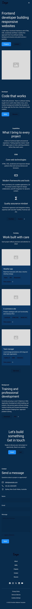
        </a>
      </td>
      <td align="center" valign="top">
        <a href="assets/wireframes/home-desktop-1440.jpg">
          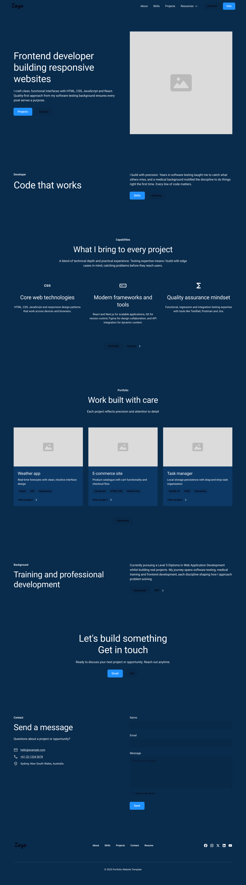
        </a>
      </td>
    </tr>
  </table>
</details>

Wireframes cover the two key layouts used in development (mobile-first + wide-screen).  
Tablet and laptop layouts were implemented and verified during build using Bootstrap breakpoints and responsive testing evidence.

## Surface

### Visual Design (Planned)
- Professional, minimal UI  
- Dark base palette with one accent colour for CTAs  
- Readable typography (Roboto)  
- Consistent spacing system across sections  
- Icons and imagery kept consistent in style and sizing 

### Style Guide

A base style guide was generated with **Relume** and used as the design system foundation in **Figma** (variables + colour schemes). I then adapted it for this project (theme, components, and consistency across breakpoints).
- **[Style Guide (Figma)](https://www.figma.com/design/Oum6hf6yA0UQKL5Vy5cadZ/Portfolio-v2?node-id=2368-52&p=f&t=cfy96xqRHufBs3Bk-0)**

### Figma Designs

High-fidelity mockups were generated with **[Relume](https://www.relume.io/)** and then refined in **Figma**.
- **[Hi-Fi Mockups (Figma)](https://www.figma.com/design/Oum6hf6yA0UQKL5Vy5cadZ/Portfolio-v2?node-id=6383-168&p=f&t=cfy96xqRHufBs3Bk-0)**

--- 

## Development Plan

This project will be delivered in **three stages** under a strict resource limit of **12 complexity points total**.

- **Complexity scale:** 1 (simple) → 3 (complex)
- The 12-point limit applies only to items selected for Stage 1–3. The backlog can exceed 12.

### Feature Backlog + Complexity

| # | Feature | Complexity |
|---:|---|---:|
| 1 | Hero | 1 |
| 2 | Section Navigation (Anchor Links) | 1 |
| 3 | About | 1 |
| 4 | Skills | 1 |
| 5 | Projects (Cards) | 2 |
| 6 | Project Proof Links (Live + GitHub) | 1 |
| 7 | Contact + Footer Repeat | 1 |
| 8 | Responsive Layout (Mobile-first + Breakpoints) | 2 |
| 9 | Accessibility Basics (Semantic + Alt + Focus + Contrast) | 2 |
| 10 | External Links: New Tab + rel | 1 |
| 11 | W3C HTML validation evidence | 1 |
| 12 | W3C Jigsaw CSS validation evidence | 1 |
| 13 | Manual testing checklist evidence | 1 |
| 14 | Screenshots aligned to user stories | 1 |
| 15 | Bug log (found/fixed/unfixed + notes) | 1 |
| 16 | CV/Resume PDF (Optional) | 1 |
| 17 | Custom 404 (Optional) | 1 |
| 18 | Repo structure for maintainability (assets/css, assets/images, etc.) | 1 |
| 19 | Attribution for external code/assets (if used) | 1 |
| 20 | Lighthouse audit evidence (targets + final scores) | 2 |

### Stage 1 — Core Value (5 points)
Goal: A first-time visitor can understand the purpose immediately, see proof of work, and contact me fast.

| Selected Feature | Complexity |
|---|---:|
| Hero | 1 |
| Projects (Cards) | 2 |
| Project Proof Links (Live + GitHub) | 1 |
| Contact + Footer Repeat | 1 |

**Stage 1 total: 5**

### Stage 2 — User-Centred Quality (4 points)
Goal: Professional experience across devices + baseline accessibility.

| Selected Feature | Complexity |
|---|---:|
| Responsive Layout (Mobile-first + Breakpoints) | 2 |
| Accessibility Basics (Semantic + Alt + Focus + Contrast) | 2 |

**Stage 2 total: 4**

### Stage 3 — Evidence for Assessment (3 points)
Goal: Provide clear evidence that validation and manual testing were completed.

| Selected Feature | Complexity |
|---|---:|
| W3C HTML validation evidence | 1 |
| W3C Jigsaw CSS validation evidence | 1 |
| Manual testing checklist evidence | 1 |

**Stage 3 total: 3**

### Total Complexity Used (Stages 1–3)
**5 + 4 + 3 = 12 points (limit met)**

Items not selected within the 12 points remain available as optional enhancements later (e.g., CV/Resume PDF, Custom 404, Screenshots, Bug log, Lighthouse, Repo structure, Attribution).

## User Stories

### Primary Visitor (Recruiter / Hiring Manager)

**US1 — Identity & role**  
As a visitor, I want to understand who the developer is immediately so I know whose work I am viewing.  
Acceptance criteria (planned):
- Name and role are visible above the fold
- Positioning statement explains focus in 1–2 lines
- CTAs to Projects and Contact are visible

**US2 — Projects & proof**  
As a visitor, I want to quickly find projects so I can evaluate examples of work.  
Acceptance criteria (planned):
- Projects are reachable via navigation and hero CTAs
- Each project includes a link to Live site
- Projects have short, scannable descriptions

**US3 — Contact**  
As a visitor, I want an easy way to contact the developer so I can reach out without friction.  
Acceptance criteria (planned):
- Email is clickable (`mailto:`)
- Contact is easy to reach from anywhere (navigation and/or footer)

**US4 — Skills scan**  
As a visitor, I want to scan skills quickly so I can assess suitability.  
Acceptance criteria (planned):
- Skills are grouped into clear categories
- The layout supports quick scanning

**US5 — Responsive experience**  
As a visitor, I want to use the site comfortably on my device.  
Acceptance criteria (planned):
- Layout adapts to mobile/tablet/desktop without breaking
- Navigation remains usable on small screens

### Site Owner

**US6 — Maintainability**  
As the site owner, I want content to be easy to update so I can maintain it over time.  
Acceptance criteria (planned):
- Projects can be added/edited without restructuring the site
- File names and structure remain consistent and readable

## Features

### Implemented Features
- **Hero:** identity, role, and primary CTAs  
- **Anchor Navigation:** navbar + footer links to sections  
- **About:** short, scannable positioning statement  
- **Skills:** grouped categories with supporting icons  
- **Projects:** responsive card layout  
- **Project Proof Links:** live demo links (and repo links if added)  
- **Contact:** clickable email/phone/location + client-side form UI  
- **Footer:** repeated navigation and social icons  
- **Responsive Layout:** mobile-first with Bootstrap breakpoints  
- **Accessibility:** alt text, semantic sections, focus visibility, contrast checks  
- **External Links:** open in new tab with safe `rel="noopener noreferrer"`  
- **CV/Resume PDF:** downloadable file hosted in repo  
- **Custom 404:** `404.html` for GitHub Pages fallback 


### Optional Features
- CV/Resume PDF (done)
- Custom 404 (done)

---

## Technologies Used

- **Bootstrap 5.3 (CDN)**
- **HTML5**
- **CSS3**
- **Google Fonts (Roboto)**

### Tools
- Git & GitHub  
- GitHub Pages  
- Figma
- Relume
- W3C HTML Validator  
- W3C CSS Validator (Jigsaw)  
- Lighthouse  

---

## Testing

### Screenshots (Aligned to User Stories)

> Screenshots below are from the **finished deployed website** and provide evidence against the user stories.

- **US1 — Identity & role (Hero above the fold)**  
  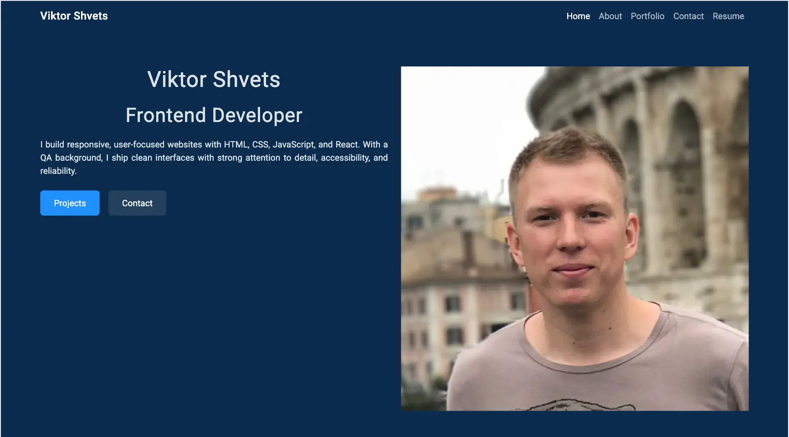

- **US2 — Projects & proof links (Projects section + external links)**  
  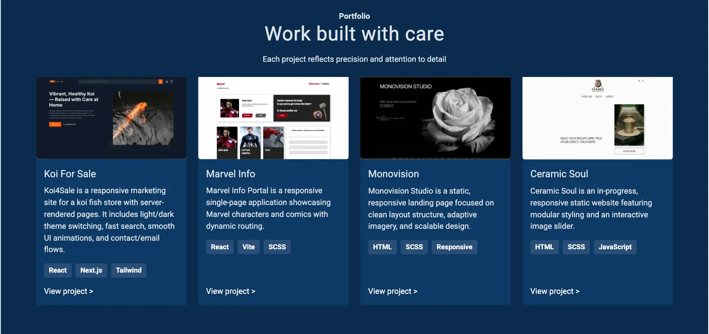

- **US3 — Contact (contact methods visible and clickable)**  
  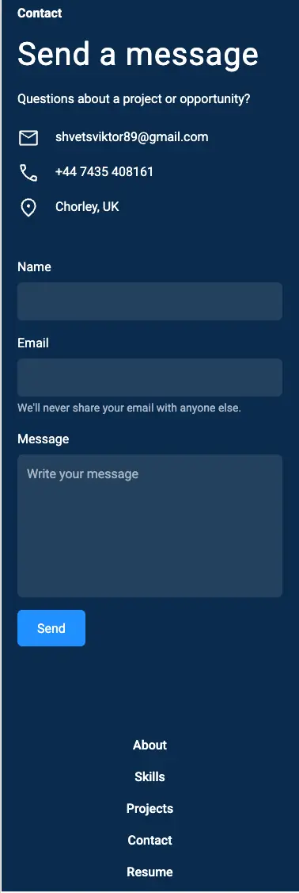

- **US4 — Skills scan (skills grouped and scannable)**  
  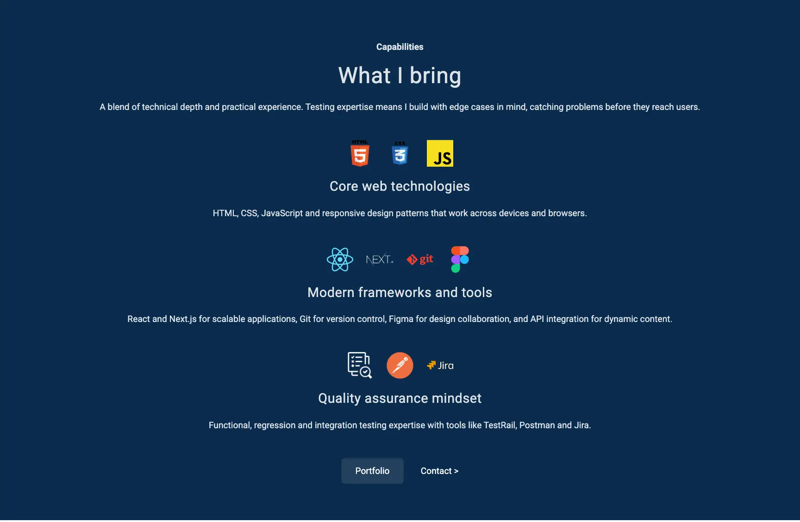

- **US5 — Responsive experience (mobile + desktop)**  
  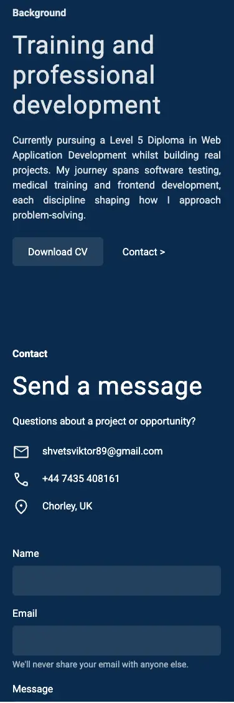  
  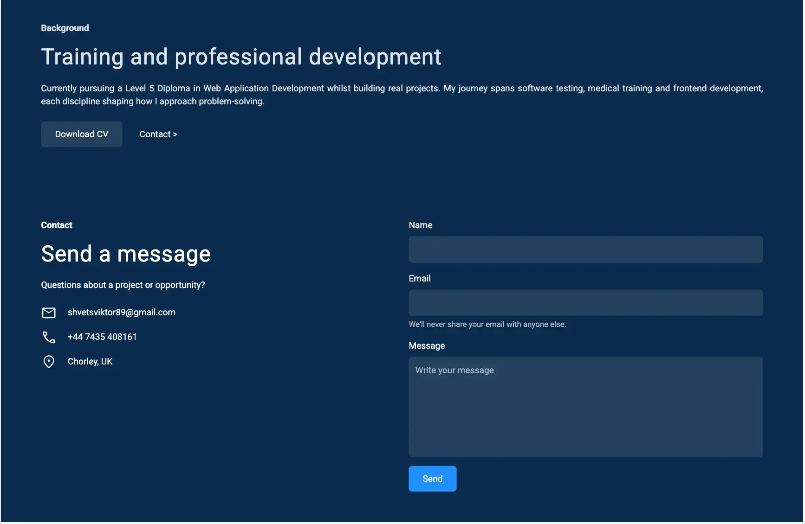

### Manual Testing Checklist

| Feature | Test | Expected | Result |
|---|---|---|---|
| Navigation | Click navbar anchors | Scrolls to correct section | ✅ Pass |
| CTAs | Hero buttons to Projects/Contact | Jumps to sections | ✅ Pass |
| Projects | Open live project links | Opens in new tab | ✅ Pass |
| Footer links | Click footer anchors | Scrolls correctly | ✅ Pass |
| Contact links | Email/phone/location | Opens correct apps/pages | ✅ Pass |
| Responsive | Mobile/tablet/desktop checks | No layout breakage | ✅ Pass |
| Accessibility | Keyboard tab through links/buttons | Visible focus + logical order | ✅ Pass |
| Images | Check scaling and aspect | Not stretched/pixelated | ✅ Pass |
| Validation | W3C HTML + CSS | No critical errors | ✅ Pass |
| Broken links | Internal anchors | All valid | ✅ Pass |

### Validation
- HTML: W3C validator — pass with two minor issues. The issues are related to reassigning default styles for better SEO and semantics in general.
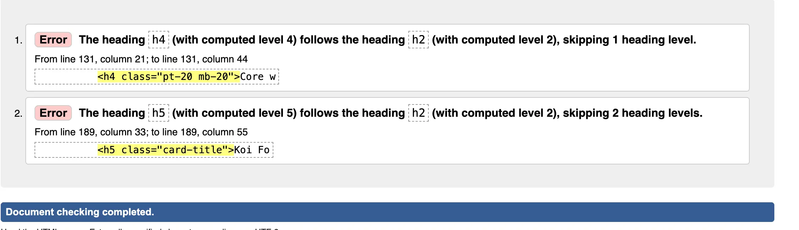
- CSS: Jigsaw validator — no issues
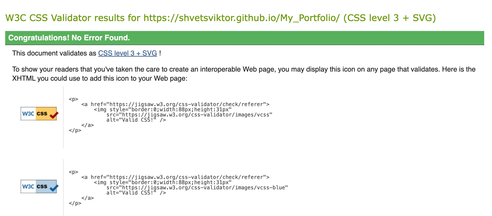

### Lighthouse
- Lighthouse
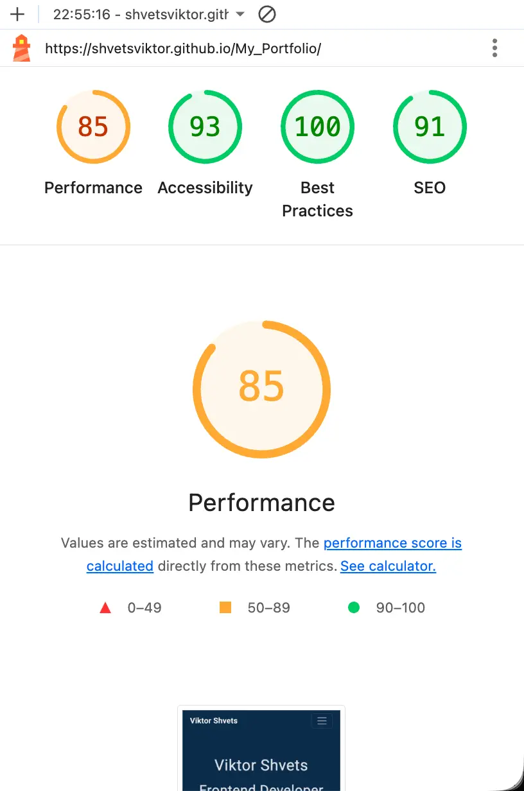

### Planned Lighthouse Targets (Reached)
- Performance 80+
- Accessibility 90+
- Best Practices 90+
- SEO 90+

## Bugs


| Bug | Cause | Fix | Status |
|---|---|---|---|
| Links appeared default-blue/underlined in Contact section | Missing section link styling | Applied Bootstrap utility classes + section-level link styles | ✅ Fixed |
| Grid spacing inconsistent in project cards | Conflicting padding/gutter classes | Standardised gutters and removed conflicting padding | ✅ Fixed |
| Icons not rendering | Wrong attribute (`href` on ``) | Replaced with correct `src` + alt | ✅ Fixed |

## Deployment

Deployed to **GitHub Pages**.

### Steps
1. Open repository on GitHub  
2. Go to **Settings → Pages**  
3. Under **Build and deployment**, choose:
   - Source: Deploy from a branch  
   - Branch: `main`  
   - Folder: `/ (root)`  
4. Save and wait for the Pages build to complete  
5. Verify the deployed site matches the local version  

### Custom 404 (GitHub Pages)
A `404.html` file is included in the root of the project. GitHub Pages automatically serves it when a route/page is not found.

### Local Development

- From the project root, run: **python3 -m http.server**

## Attribution, Acknowledgements

### Attribution

All custom code and layout decisions were implemented by me. External resources:
- **Bootstrap (CDN):** Bootstrap 5.3  
- **Font:** Roboto sans-serif via Google Fonts  
- **Icons:** Icons8
- **Wireframes & Mockups:** https://www.relume.io/
- **ChatGPT:** AI-assisted copy drafting (reviewed and edited by me)
- **[TinyPNG](https://tinypng.com/):** Image optimisation

### Acknowledgements

- **Bootstrap documentation:** https://getbootstrap.com/docs/5.3/getting-started/introduction/
- **Relume documentation:** https://www.relume.io/resources/home#site-builder
- **MDN Web Docs (HTML/CSS):** https://developer.mozilla.org/

## Assessment Checklist (Pass / Merit / Distinction)

This checklist confirms completed requirements.  
[x] = completed and evidenced in this repository/README.

### Learning Outcome 1 — Design (UX, Accessibility, Responsiveness)
- [x] **1.1** Main navigation menu + structured layout  
- [x] **1.2** Accessibility applied (contrast, alt text equivalents, focus visibility)  
- [x] **1.3** Information hierarchy and prioritisation  
- [x] **1.4** Foreground information not distracted by backgrounds  
- [x] **1.5** Graphics consistent in style and colour  
- [x] **1.6** User initiates and controls actions (no autoplay/pop-ups)  
- [x] **M(i)** Clear flow of information and interaction intent  

### Learning Outcome 2 — Build (HTML/CSS)
- [x] **2.1** Single-page with 3+ distinct page areas  
- [x] **2.2** Custom CSS passes Jigsaw validator with no issues  
- [x] **2.3** Custom HTML passes W3C validator with no issues  
- [x] **2.4** Images not pixelated or stretched  
- [x] **2.5** External links open in a separate tab + safe `rel`  
- [x] **2.6** Responsive layout via Bootstrap breakpoints  
- [x] **2.7** Semantic markup used appropriately  
- [x] **2.8** Site-specific content (no Lorem Ipsum)  
- [x] **2.9** Clear, intuitive navigation  
- [x] **M(ii)** Purpose immediately evident to a new user  
- [x] **M(iii)** Implementation meets user story demands and expectations  

### Learning Outcome 3 — Maintainability (Documentation + Structure)
- [x] **3.1** README explains purpose, user value, and deployment procedure  
- [x] **3.2** Screenshots aligned to user stories  
- [x] **3.3** External code/assets attributed in code comments + README  
- [x] **3.4** Clear separation of custom code vs external sources  
- [x] **3.5** HTML/CSS organised into well-defined, commented sections  
- [x] **3.6** CSS in external file linked in `<head>`  
- [x] **3.7** Code readability standards (indentation, spacing)  
- [x] **3.8** Consistent file naming (lowercase where applicable, no spaces)  
- [x] **3.9** Files grouped in directories by type  

### Learning Outcome 4 — Version Control
- [x] **4.1** Git/GitHub used throughout development  
- [x] **4.2** Development process documented via commit messages  
- [x] **4.3** README uses consistent markdown formatting  
- [x] **M(iv)** Small, frequent commits with clear messages  

### Learning Outcome 5 — Testing + Deployment
- [x] **5.1** Manual testing procedures designed and implemented  
- [x] **5.2** Testing documented with results  
- [x] **5.3** Deployed to GitHub Pages and verified against local build  
- [x] **5.4** No commented-out code in final deploy  
- [x] **5.5** No broken internal links  
- [x] **M(v)** Clear rationale addressing target audience needs and user stories  
- [x] **M(vi)** Bug log includes fixes and notes  
- [x] **M(vii)** Development lifecycle documented in README

---

## Repo Structure

```text
assets/
  css/
  cv/
  favicon/
  icons/
  images/
  mockups/
  testing/
  wireframes/
404.html
index.html
README.md