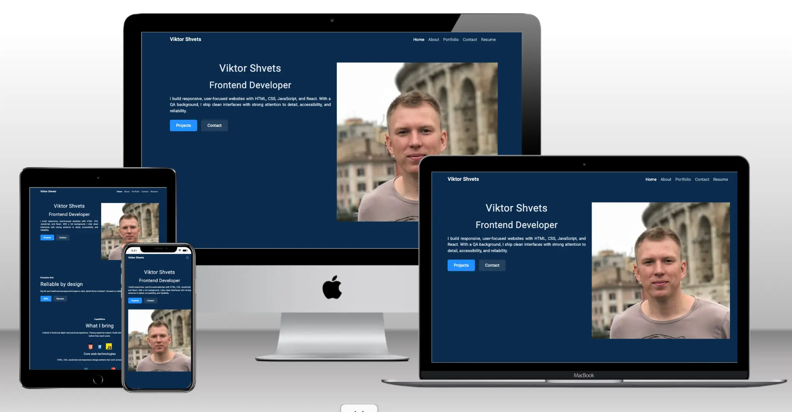
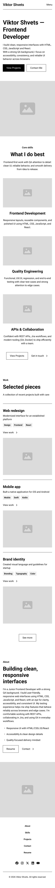
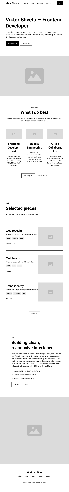
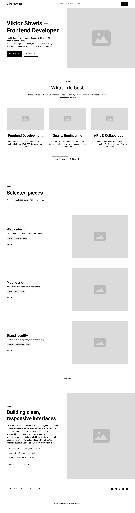
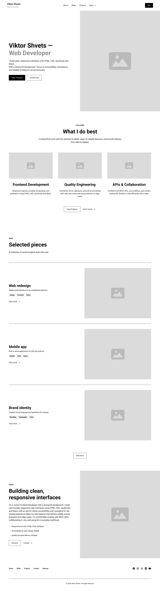

# Portfolio Website – Web Developer Portfolio

  
<strong>Live Website</strong>

- **Live site:** https://shvetsviktor.github.io/My_Portfolio/ 
- **Repository:** https://github.com/ShvetsViktor/My_Portfolio

## Overview

This project is a **single-page** portfolio website built with **HTML5** and **CSS3**.

It follows a **user-centred front-end development** approach: the focus is on clear purpose, strong information hierarchy, accessibility, responsiveness, and professional documentation.

> **Status:** Coding completed. Texting is in progress.

## Table of Contents

1. [Project Goals](#project-goals)
2. [Target Audience](#target-audience)
3. [User Needs](#user-needs)
4. [Success Criteria](#success-criteria)
5. [Content Principles](#content-principles)
6. [Five Planes of UX](#five-planes-of-ux)
   - [Strategy](#strategy)
   - [Scope](#scope)
   - [Structure](#structure)
   - [Skeleton](#skeleton)
   - [Surface](#surface)
7. [Development Plan](#development-plan)
8. [User Stories](#user-stories)
9. [Features](#features)
10. [Technologies Used](#technologies-used)
11. [Testing](#testing)
12. [Bugs](#bugs)
13. [Deployment](#deployment)
14. [Attribution, Credits, Acknowledgements](#attribution-credits-acknowledgements)
15. [Assessment Checklist (Pass / Merit / Distinction)](#assessment-checklist-pass--merit--distinction)

## Project Goals

### User Goals
- Understand who I am and what role I’m targeting quickly
- Find projects easily and access proof (Live / GitHub)
- Scan skills at a glance
- Find contact details with minimal effort
- Have a smooth experience on any device

### Site Owner Goals
- Present a professional profile suitable for the UK job market
- Showcase learning progress and real examples of work
- Demonstrate UX thinking, accessibility awareness, and clean front-end structure
- Make it easy for recruiters/employers to contact me

## Target Audience

- Recruiters reviewing candidates for junior web development roles
- Hiring managers assessing practical skills through projects
- Developers or collaborators interested in my work
- Potential clients who want to see what I can build

## User Needs

Visitors should be able to:
- Confirm identity + role within 30–60 seconds
- Find Projects quickly and verify proof (Live + GitHub)
- Scan skills without reading long paragraphs
- Contact me in one step
- Navigate comfortably on mobile, tablet, and desktop

## Success Criteria

This project is successful when:
- The purpose is immediately evident to a new visitor (who I am + what I do)
- Projects and proof links are easy to find and use
- Contact methods are clear, clickable, and visible without searching
- Layout remains readable and stable across devices
- Accessibility basics are applied consistently (headings, contrast, focus, alt text)

## Content Principles

- Proof over claims: links and demos support statements
- Scannable layout: short paragraphs, bullets, consistent headings
- Professional tone aligned to the UK recruitment context
- Employability-focused “About” section (relevant background only)
- Contact info visible and repeated in the footer

## Five Planes of UX

## Strategy

### Business Goals (Site Owner)
- Increase recruiter interaction (email / LinkedIn contact)
- Provide proof of skills through projects and GitHub
- Maintain a clean, credible, accessible UI

### Primary User Goals
- Understand identity and target role quickly
- Find projects and proof links with minimal effort
- Reach contact details immediately

### Feature Names (Used Consistently Across This README)
- **Hero**
- **Section Navigation (Anchor Links)**
- **About**
- **Skills**
- **Projects (Cards)**
- **Project Proof Links (Live + GitHub)**
- **Contact + Footer Repeat**
- **Responsive Layout (Mobile-first + Breakpoints)**
- **Accessibility Basics (Semantic + Alt + Focus + Contrast)**
- **External Links: New Tab + rel**
- **CV/Resume PDF (Optional)**
- **Custom 404 (Optional)**

### Prioritisation Method (Value Trade-off)
**Score = Importance (1–5) × Feasibility (1–5)**

| Feature | Importance | Feasibility | Score |
|---|---:|---:|---:|
| Hero | 5 | 5 | 25 |
| Projects (Cards) | 5 | 5 | 25 |
| Project Proof Links (Live + GitHub) | 5 | 5 | 25 |
| Contact + Footer Repeat | 5 | 5 | 25 |
| Responsive Layout (Mobile-first + Breakpoints) | 5 | 4 | 20 |
| Skills | 4 | 5 | 20 |
| Accessibility Basics (Semantic + Alt + Focus + Contrast) | 4 | 4 | 16 |
| Section Navigation (Anchor Links) | 4 | 4 | 16 |
| External Links: New Tab + rel | 4 | 4 | 16 |
| CV/Resume PDF (Optional) | 4 | 3 | 12 |
| Custom 404 (Optional) | 3 | 4 | 12 |
| About | 3 | 5 | 15 |

## Scope

### In Scope (MVP)
- **Hero**
- **Section Navigation (Anchor Links)**
- **About**
- **Skills**
- **Projects (Cards)**
- **Project Proof Links (Live + GitHub)**
- **Contact + Footer Repeat**
- **Responsive Layout (Mobile-first + Breakpoints)**
- **Accessibility Basics (Semantic + Alt + Focus + Contrast)**
- **External Links: New Tab + rel**
- Site-specific content (no Lorem Ipsum)

### Out of Scope (This Project)
- Any backend functionality (databases, authentication, admin panels)
- Contact forms that send emails server-side (no backend)
- Returning-user personalisation or tracking
- Analytics integration (unless added later as an enhancement)

### Constraints / Assumptions
- Single-page layout with multiple distinct sections
- HTML/CSS only (JavaScript not required for the MVP)
- Limited resources (release planning uses a strict 12-point limit)

### Definition of Done (MVP)
- Deployed to GitHub Pages
- Navigation works and all internal links are valid
- Responsive across key breakpoints
- HTML passes W3C validation (no issues)
- CSS passes Jigsaw validation (no issues)
- External links open in a new tab and include safe `rel` attributes
- No placeholder text; content is clear and role-relevant

## Structure

### Information Architecture (Single Page)
Planned section order:
- Home / Hero
- About
- Skills
- Projects
- CV/Resume PDF (Optional)
- Contact
- Footer

### Navigation Model
- Main navigation with anchor links to each section
- CTAs in Hero link to Projects and Contact
- External links open in a new tab (GitHub, LinkedIn, Live demos)

### Information Hierarchy Rules
- The most important information appears first (identity → proof → contact)
- Headings communicate structure clearly
- Background styling never competes with foreground content

## Skeleton / Wireframes

  
<b>Wireframes (Mobile → Desktop, 4 breakpoints)</b>

  <table>
    <tr>
      <td align="center" valign="top"><b>375 (Mobile)</b></td>
      <td align="center" valign="top"><b>768 (Tablet)</b></td>
      <td align="center" valign="top"><b>1280 (Laptop)</b></td>
      <td align="center" valign="top"><b>1440 (Desktop)</b></td>
    </tr>
    <tr>
      <td align="center" valign="top">
        
      </td>
      <td align="center" valign="top">
        
      </td>
      <td align="center" valign="top">
        
      </td>
      <td align="center" valign="top">
        
      </td>
    </tr>
  </table>

### Layout Approach
- Mobile-first layout
- Projects presented as cards in a responsive grid
- Consistent spacing and clear section boundaries
- No autoplay media; users initiate actions

## Surface

### Visual Design (Planned)
- Minimal, professional visual style
- Neutral palette with one accent colour for CTAs/links
- Typography chosen for readability
- Consistent style for graphics and icons

### Link to Figma Designs
- https://www.figma.com/design/Oum6hf6yA0UQKL5Vy5cadZ/Portfolio-v2?node-id=6383-168&t=ZgBdYsM2Ve70heRQ-1

## Development Plan

This project will be delivered in **three stages** under a strict resource limit of **12 complexity points total**.

- **Complexity scale:** 1 (simple) → 3 (complex)
- The 12-point limit applies only to items selected for Stage 1–3. The backlog can exceed 12.

### Feature Backlog + Complexity

| # | Feature | Complexity |
|---:|---|---:|
| 1 | Hero | 1 |
| 2 | Section Navigation (Anchor Links) | 1 |
| 3 | About | 1 |
| 4 | Skills | 1 |
| 5 | Projects (Cards) | 2 |
| 6 | Project Proof Links (Live + GitHub) | 1 |
| 7 | Contact + Footer Repeat | 1 |
| 8 | Responsive Layout (Mobile-first + Breakpoints) | 2 |
| 9 | Accessibility Basics (Semantic + Alt + Focus + Contrast) | 2 |
| 10 | External Links: New Tab + rel | 1 |
| 11 | W3C HTML validation evidence | 1 |
| 12 | W3C Jigsaw CSS validation evidence | 1 |
| 13 | Manual testing checklist evidence | 1 |
| 14 | Screenshots aligned to user stories | 1 |
| 15 | Bug log (found/fixed/unfixed + notes) | 1 |
| 16 | CV/Resume PDF (Optional) | 1 |
| 17 | Custom 404 (Optional) | 1 |
| 18 | Repo structure for maintainability (assets/css, assets/images, etc.) | 1 |
| 19 | Attribution for external code/assets (if used) | 1 |
| 20 | Lighthouse audit evidence (targets + final scores) | 2 |

### Stage 1 — Core Value (5 points)
Goal: A first-time visitor can understand the purpose immediately, see proof of work, and contact me fast.

| Selected Feature | Complexity |
|---|---:|
| Hero | 1 |
| Projects (Cards) | 2 |
| Project Proof Links (Live + GitHub) | 1 |
| Contact + Footer Repeat | 1 |

**Stage 1 total: 5**

### Stage 2 — User-Centred Quality (4 points)
Goal: Professional experience across devices + baseline accessibility.

| Selected Feature | Complexity |
|---|---:|
| Responsive Layout (Mobile-first + Breakpoints) | 2 |
| Accessibility Basics (Semantic + Alt + Focus + Contrast) | 2 |

**Stage 2 total: 4**

### Stage 3 — Evidence for Assessment (3 points)
Goal: Provide clear evidence that validation and manual testing were completed.

| Selected Feature | Complexity |
|---|---:|
| W3C HTML validation evidence | 1 |
| W3C Jigsaw CSS validation evidence | 1 |
| Manual testing checklist evidence | 1 |

**Stage 3 total: 3**

### Total Complexity Used (Stages 1–3)
**5 + 4 + 3 = 12 points (limit met)**

Items not selected within the 12 points remain available as optional enhancements later (e.g., CV/Resume PDF, Custom 404, Screenshots, Bug log, Lighthouse, Repo structure, Attribution).

## User Stories

### Primary Visitor (Recruiter / Hiring Manager)

**US1 — Identity & role**  
As a visitor, I want to understand who the developer is immediately so I know whose work I am viewing.  
Acceptance criteria (planned):
- Name and role are visible above the fold
- Positioning statement explains focus in 1–2 lines
- CTAs to Projects and Contact are visible

**US2 — Projects & proof**  
As a visitor, I want to quickly find projects so I can evaluate examples of work.  
Acceptance criteria (planned):
- Projects are reachable via navigation and hero CTAs
- Each project includes Live + GitHub links
- Projects have short, scannable descriptions

**US3 — Contact**  
As a visitor, I want an easy way to contact the developer so I can reach out without friction.  
Acceptance criteria (planned):
- Email is clickable (`mailto:`)
- LinkedIn/GitHub links are clear and accessible
- Contact is easy to reach from anywhere (navigation and/or footer)

**US4 — Skills scan**  
As a visitor, I want to scan skills quickly so I can assess suitability.  
Acceptance criteria (planned):
- Skills are grouped into clear categories
- The layout supports quick scanning

**US5 — Responsive experience**  
As a visitor, I want to use the site comfortably on my device.  
Acceptance criteria (planned):
- Layout adapts to mobile/tablet/desktop without breaking
- Navigation remains usable on small screens

### Site Owner

**US6 — Maintainability**  
As the site owner, I want content to be easy to update so I can maintain it over time.  
Acceptance criteria (planned):
- Projects can be added/edited without restructuring the site
- File names and structure remain consistent and readable

## Features

This section will be updated during implementation with screenshots aligned to relevant user stories.

### MVP Features (Planned)
- Hero
- Section Navigation (Anchor Links)
- About
- Skills
- Projects (Cards)
- Project Proof Links (Live + GitHub)
- Contact + Footer Repeat
- Responsive Layout (Mobile-first + Breakpoints)
- Accessibility Basics (Semantic + Alt + Focus + Contrast)
- External Links: New Tab + rel

### Optional Features
- CV/Resume PDF (Optional)
- Custom 404 (Optional)

## Technologies Used

- Bootstrap 5.3

### Planned Languages
- HTML5
- CSS3

### Planned Tools
- Git & GitHub
- GitHub Pages
- W3C HTML Validator
- W3C CSS Validator (Jigsaw)
- Lighthouse

## Testing

Testing will be documented during development and expanded with screenshots and results.

### Planned Manual Testing Procedure
- Navigation: section links work and are intuitive
- Responsiveness: layout integrity across device sizes
- Accessibility: keyboard navigation, focus visibility, headings order, alt text
- Links: external links open in a new tab; no broken internal links

### Planned Validation Targets
- HTML: W3C validator — no issues
- CSS: Jigsaw validator — no issues

### Planned Lighthouse Targets (Optional)
- Performance 90+
- Accessibility 90+
- Best Practices 90+
- SEO 90+

## Bugs

This section will be updated during development with bugs found, fixes applied, and any unfixed issues with justification.

## Deployment

Planned deployment method: **GitHub Pages**.

1. Go to the repository on GitHub
2. Click **Settings**
3. Open **Pages**
4. Under **Build and deployment**, select:
   - Source: Deploy from a branch
   - Branch: `main`
   - Folder: `/ (root)`
5. Save changes and verify the deployed site matches the development version

### Local Development
- Open `index.html` in a browser, or
- Use VS Code Live Server

## Attribution, Credits, Acknowledgements

### Attribution
All code is written by me unless explicitly stated.  
Any external snippets or libraries will be attributed in code comments and/or in this README.

### Credits (Planned)
- Fonts: Google Fonts (if used)
- Icons: Font Awesome (if used)

### Acknowledgements
- Tutors / mentors / peers
- Open-source documentation and community resources

## Assessment Checklist (Pass / Merit / Distinction)

This checklist is a progress tracker for the project requirements.  
[x] = evidenced in this repository/README. [ ] = will be evidenced during development.

### Learning Outcome 1 — Design (UX, Accessibility, Responsiveness)
- [ ] **1.1** Main navigation menu + structured layout
- [ ] **1.2** Accessibility planned (contrast, alt text equivalents for non-text elements)
- [x] **1.3** Information hierarchy and prioritisation (clear headings; info easy to find)
- [ ] **1.4** Foreground information not distracted by backgrounds
- [ ] **1.5** Graphics consistent in style and colour
- [x] **1.6** User initiates and controls actions (no autoplay/pop-ups; user control for media)
- [x] **M(i)** Clear flow of information and interaction intent; unambiguous

### Learning Outcome 2 — Build (HTML/CSS)
- [ ] **2.1** Single-page with 3+ distinct page areas (or 3+ pages)
- [ ] **2.2** Custom CSS passes Jigsaw validator with no issues
- [ ] **2.3** Custom HTML passes W3C validator with no issues
- [ ] **2.4** Images not pixelated or stretched
- [ ] **2.5** External links open in a separate tab
- [ ] **2.6** Responsive layout via media queries/Grid/Bootstrap
- [ ] **2.7** Semantic markup used appropriately
- [ ] **2.8** Site-specific content (no Lorem Ipsum)
- [ ] **2.9** Clear, intuitive navigation
- [ ] **M(ii)** Purpose immediately evident to a new user
- [ ] **M(iii)** Implementation meets user story demands and expectations

### Learning Outcome 3 — Maintainability (Documentation + Structure)
- [x] **3.1** README explains purpose, user value, and deployment procedure
- [ ] **3.2** Screenshots of finished project aligned to user stories
- [ ] **3.3** External code attributed in code comments + README (larger dependencies)
- [ ] **3.4** Clear separation of custom code vs external sources
- [ ] **3.5** HTML/CSS organised into well-defined, commented sections
- [ ] **3.6** CSS in external file linked in `<head>`
- [ ] **3.7** Code readability standards (indentation, spacing)
- [ ] **3.8** Consistent file naming (lowercase, no spaces)
- [ ] **3.9** Files grouped in directories by type (e.g. `assets/css`, `assets/images`)

### Learning Outcome 4 — Version Control
- [ ] **4.1** Git/GitHub used throughout development
- [ ] **4.2** Development process documented via commit messages
- [ ] **4.3** README uses consistent markdown formatting; well-structured; few grammatical errors
- [ ] **M(iv)** Small, frequent commits per feature/fix with clear messages

### Learning Outcome 5 — Testing + Deployment
- [ ] **5.1** Manual testing procedures designed and implemented
- [ ] **5.2** Testing documented (README or separate file)
- [ ] **5.3** Deployed to a cloud platform and verified matches development version
- [ ] **5.4** No commented-out code in final deploy
- [ ] **5.5** No broken internal links
- [x] **M(v)** Clear rationale in README addressing target audience needs and user stories
- [ ] **M(vi)** Testing documentation includes bugs found + fixes + any unfixed bugs explained
- [ ] **M(vii)** Development life cycle fully documented in README

### Distinction Characteristics
- [ ] Professional, publishable UI; no obvious errors; interaction quality evidenced
- [ ] Evidence of testing at all stages + end testing; evaluation of remaining bugs
- [ ] Deviations from UX best practice identified and justified
- [ ] Commit history clearly evidences and justifies development decisions

To do:

- To import a font.